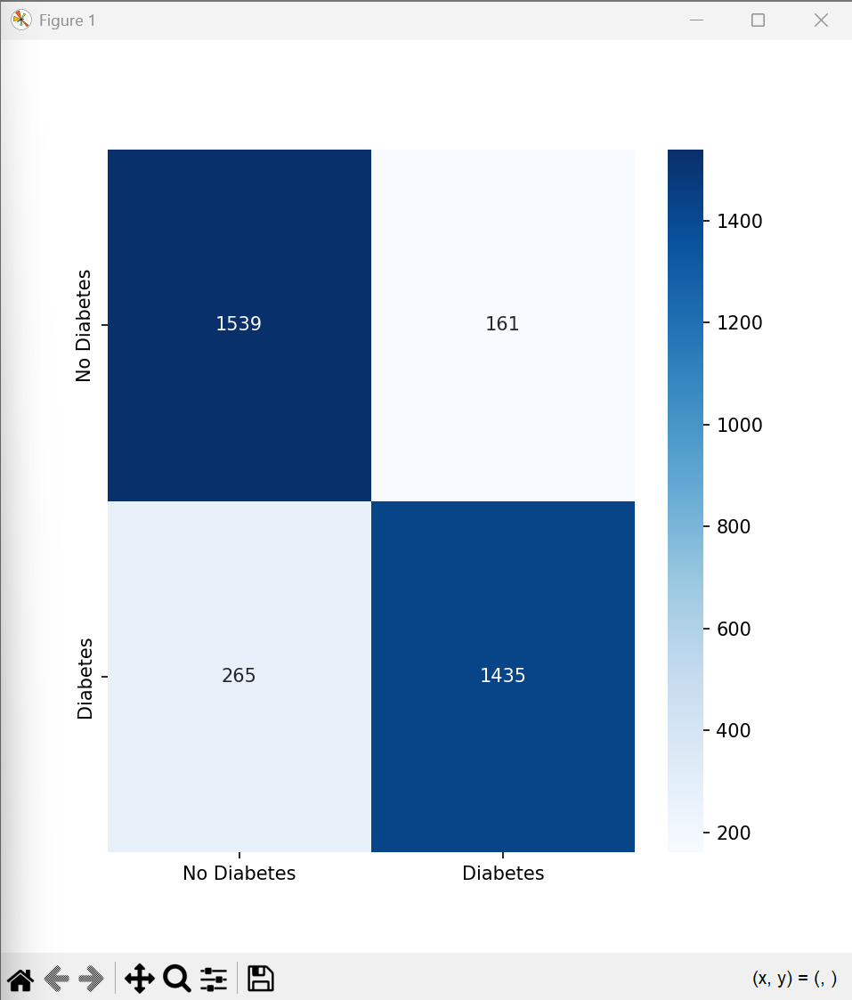
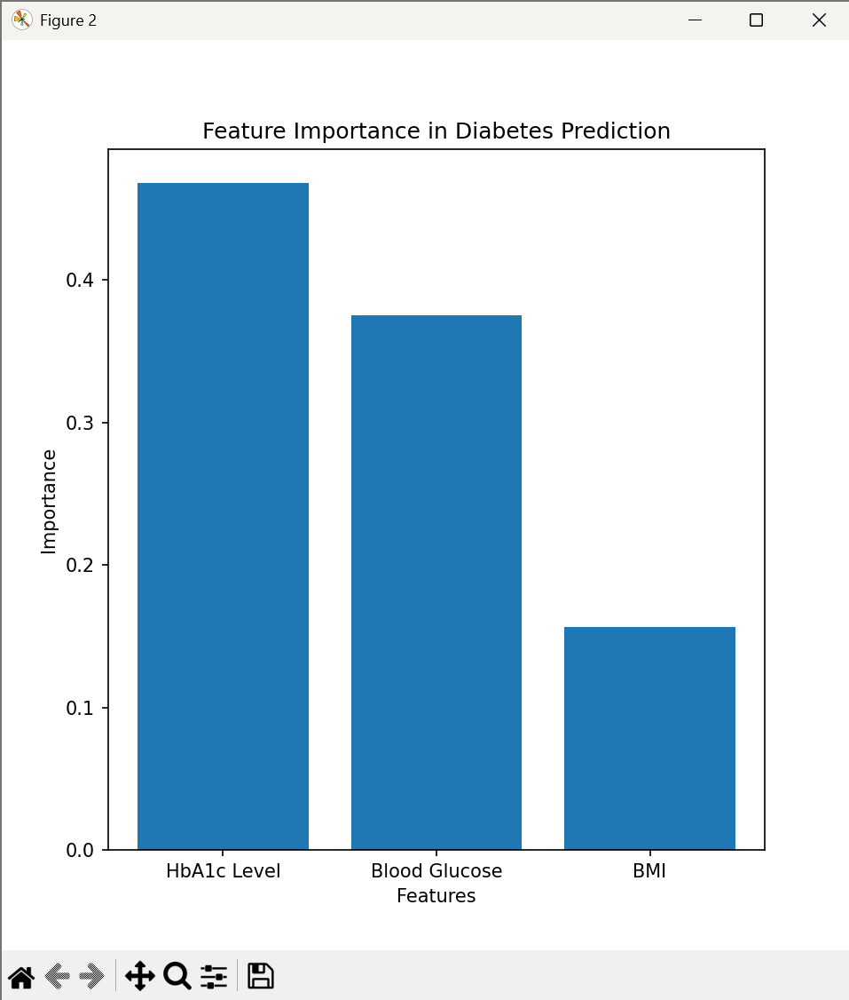
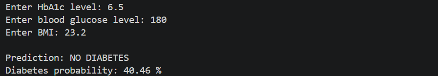
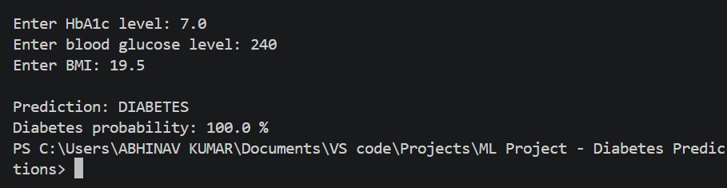
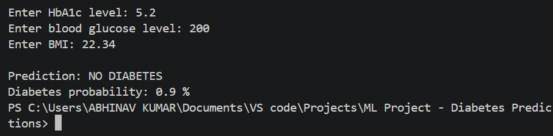
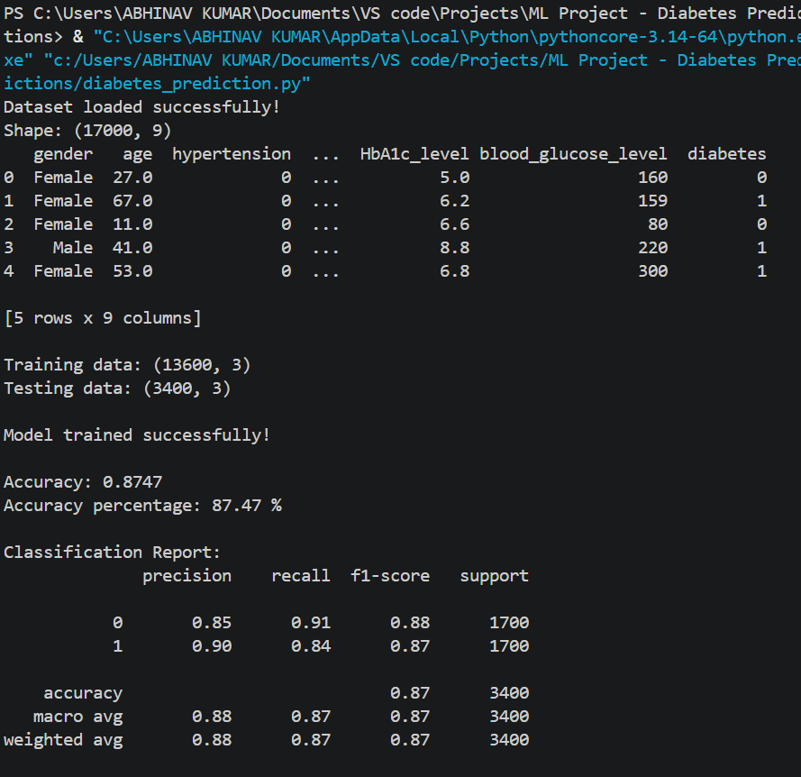

# Diabetes Prediction using Machine Learning

A simple Machine Learning project that predicts whether a person is likely to have diabetes using **HbA1c level, blood glucose level, and BMI**.

The project uses a **Random Forest Classifier** and is designed as an ML Laboratory project with a clear, easy-to-understand workflow.

> **Disclaimer:** This is an academic/educational project. The model is not a medical diagnostic tool and should not be used to make medical decisions.

---

## Project Overview

This project treats diabetes prediction as a **binary classification problem**:

- `0` → No Diabetes
- `1` → Diabetes

The model uses only three input features:

1. **HbA1c Level**
2. **Blood Glucose Level**
3. **BMI**

The final model achieved **87.47% accuracy** on the test set.

---

## Dataset

The dataset is the **Diabetes Prediction Dataset** obtained from **Kaggle**.

### Original Dataset

- Records: **100,000**
- Attributes: **9**
- Target: `diabetes`

### Original Class Distribution

| Class | Records |
|---|---:|
| No Diabetes | 91,500 |
| Diabetes | 8,500 |

The original dataset was imbalanced, so it was balanced before training.

### Balanced Dataset

Random undersampling was used:

- All **8,500 diabetic records** were retained.
- **8,500 non-diabetic records** were randomly selected.
- The two classes were combined and shuffled.
- `random_state = 42` was used for reproducibility.

Final dataset:

| Class | Records |
|---|---:|
| No Diabetes | 8,500 |
| Diabetes | 8,500 |
| **Total** | **17,000** |

The repository's `diabetes_prediction_dataset.csv` is this balanced 17,000-row dataset.

---

## Features Used

Only three attributes are used by the model.

| Feature | Why it is included |
|---|---|
| `HbA1c_level` | A blood-sugar-related measurement that is highly informative for distinguishing diabetic and non-diabetic cases in this dataset. |
| `blood_glucose_level` | Directly related to the condition being predicted and provides strong predictive information. |
| `bmi` | Provides an additional numerical health measurement that can contribute useful information alongside glucose-related measurements. |

These three features also keep the project simple because they are numerical and do not require categorical encoding.

---

## Features Excluded

The original dataset also contains:

| Feature | Reason for exclusion |
|---|---|
| `gender` | Not required for the selected three-feature model. It would also introduce categorical preprocessing. |
| `age` | Can be useful, but was excluded to keep the model focused on the selected three measurements. |
| `hypertension` | Not included in the chosen three-feature input set. |
| `heart_disease` | Not included in the chosen three-feature input set. |
| `smoking_history` | Categorical information requiring additional encoding; excluded to keep preprocessing simple. |

The project therefore focuses on one specific question:

> **How well can diabetes be classified using only HbA1c level, blood glucose level, and BMI?**

---

## Why Random Forest?

A **Random Forest Classifier** was selected because it provides a good balance between simplicity, performance, and interpretability for this tabular dataset.

| Algorithm | Reason |
|---|---|
| Logistic Regression | Mainly models linear relationships. |
| Decision Tree | A single tree can overfit the training data. |
| K-Nearest Neighbors | More sensitive to feature scaling and local data distribution. |
| SVM | More complex than necessary for this simple project. |
| **Random Forest** | Combines multiple decision trees, handles nonlinear relationships, is robust for tabular data, and provides feature importance. |

Random Forest was therefore chosen as the main model for this project.

---

## Random Forest Parameters

```python
RandomForestClassifier(
    n_estimators=300,
    max_depth=12,
    min_samples_split=5,
    min_samples_leaf=2,
    random_state=42
)
```

| Parameter | Value | Purpose |
|---|---:|---|
| `n_estimators` | 300 | Number of decision trees in the forest. |
| `max_depth` | 12 | Controls the maximum depth of each tree. |
| `min_samples_split` | 5 | Minimum samples required to split a node. |
| `min_samples_leaf` | 2 | Minimum samples allowed in a leaf. |
| `random_state` | 42 | Makes the result reproducible. |

---

## Project Workflow

```text
                    Kaggle Dataset
                          |
                          v
                 Dataset Balancing
                          |
                          v
                  Select 3 Features
                          |
              +-----------+-----------+
              |           |           |
            HbA1c       Glucose       BMI
              |           |           |
              +-----------+-----------+
                          |
                          v
                  Train/Test Split
                          |
                          v
                  Random Forest
                          |
                          v
                      Prediction
                     /                              /                               v              v
             No Diabetes       Diabetes
```

---

## Train-Test Split

The balanced dataset contains **17,000 records**.

An **80:20 train-test split** is used:

- Training records: **13,600**
- Testing records: **3,400**

The code uses:

```python
stratify=y
```

to maintain the class distribution in the training and testing sets.

---

## Model Evaluation

The model is evaluated using:

- Accuracy
- Precision
- Recall
- F1-score
- Confusion Matrix

### Final Results

**Accuracy: 87.47%**

| Class | Precision | Recall | F1-score |
|---|---:|---:|---:|
| No Diabetes | 0.85 | 0.91 | 0.88 |
| Diabetes | 0.90 | 0.84 | 0.87 |

Macro-average F1-score: **~0.87**

---

## Confusion Matrix

The final confusion matrix contains:

- **1,539** True Negatives
- **161** False Positives
- **265** False Negatives
- **1,435** True Positives



---

## Feature Importance

The Random Forest feature importance values are approximately:

| Feature | Importance |
|---|---:|
| HbA1c Level | 0.47 |
| Blood Glucose | 0.37 |
| BMI | 0.15 |



> Feature importance represents how the trained model uses the features. It should not be interpreted as medical causation.

---

## Sample Predictions

The program accepts three values:

```text
HbA1c Level
Blood Glucose Level
BMI
```

and returns:

```text
Prediction
Diabetes Probability
```

### Test Case 1

**Input**

```text
HbA1c: 6.5
Blood Glucose: 180
BMI: 23.2
```

**Output**

```text
Prediction: NO DIABETES
Diabetes probability: 40.46%
```



---

### Test Case 2

**Input**

```text
HbA1c: 7.0
Blood Glucose: 240
BMI: 19.5
```

**Output**

```text
Prediction: DIABETES
Diabetes probability: 100.0%
```



---

### Test Case 3

**Input**

```text
HbA1c: 5.2
Blood Glucose: 200
BMI: 22.34
```

**Output**

```text
Prediction: NO DIABETES
Diabetes probability: 0.9%
```



---

## Model Performance Output

The program also prints the dataset shape, train-test split, accuracy, and classification report.



---

## Technologies Used

- Python
- Pandas
- Scikit-learn
- Matplotlib
- Seaborn

---

## Project Structure

```text
diabetes-prediction/
│
├── diabetes_prediction.py
├── diabetes_prediction_dataset.csv
├── requirements.txt
├── README.md
├── .gitignore
├── Diabetes_Prediction_Project_Report_Final.docx
│
└── outputs/
    ├── model_performance.png
    ├── confusion_matrix.png
    ├── feature_importance.png
    ├── prediction_test_1.png
    ├── prediction_test_2.png
    └── prediction_test_3.png
```

---

## How to Run

### 1. Clone the repository

```bash
git clone https://github.com/YOUR-USERNAME/YOUR-REPOSITORY.git
```

### 2. Open the project folder

```bash
cd YOUR-REPOSITORY
```

### 3. Install dependencies

```bash
pip install -r requirements.txt
```

Or:

```bash
pip install pandas scikit-learn matplotlib seaborn
```

### 4. Run the program

```bash
python diabetes_prediction.py
```

### 5. Enter the values

```text
Enter HbA1c level:
Enter blood glucose level:
Enter BMI:
```

The model will then display the prediction and diabetes probability.

---

## Example

```text
Enter HbA1c level: 7.0
Enter blood glucose level: 240
Enter BMI: 19.5

Prediction: DIABETES
Diabetes probability: 100.0 %
```

---

## Learning Outcomes

This project demonstrates:

- Dataset loading using Pandas
- Dataset balancing using random undersampling
- Feature selection
- Train-test splitting
- Random Forest classification
- Model training
- Prediction
- Accuracy calculation
- Precision, recall and F1-score
- Confusion matrix visualization
- Feature importance
- Probability-based predictions

---

## Author

**Abhinav Kumar**

**Roll No.:** 24VE1A66H9

**Class:** III-I CSE (AIML)-3

**Subject:** ML Laboratory

**Project:** Diabetes Prediction using Machine Learning

---

## Disclaimer

This project is intended for **academic and educational purposes only**.

The predictions generated by this model should **not be considered a medical diagnosis**. Real-world medical decisions should be made by qualified healthcare professionals using appropriate clinical information and medical testing.
